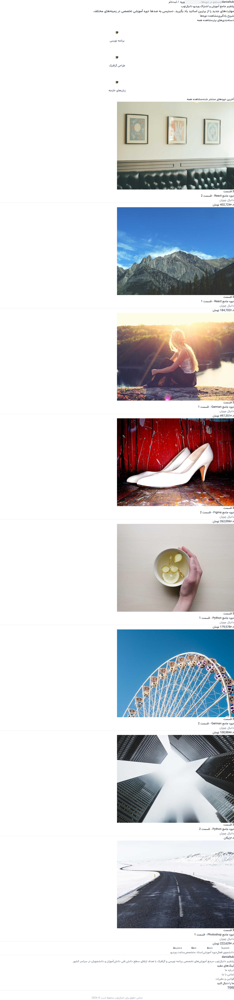
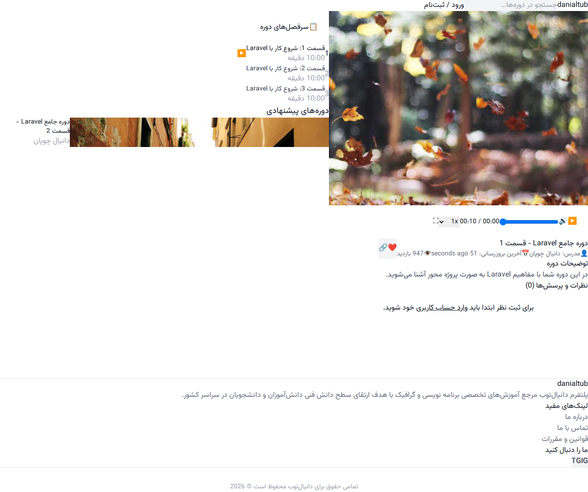
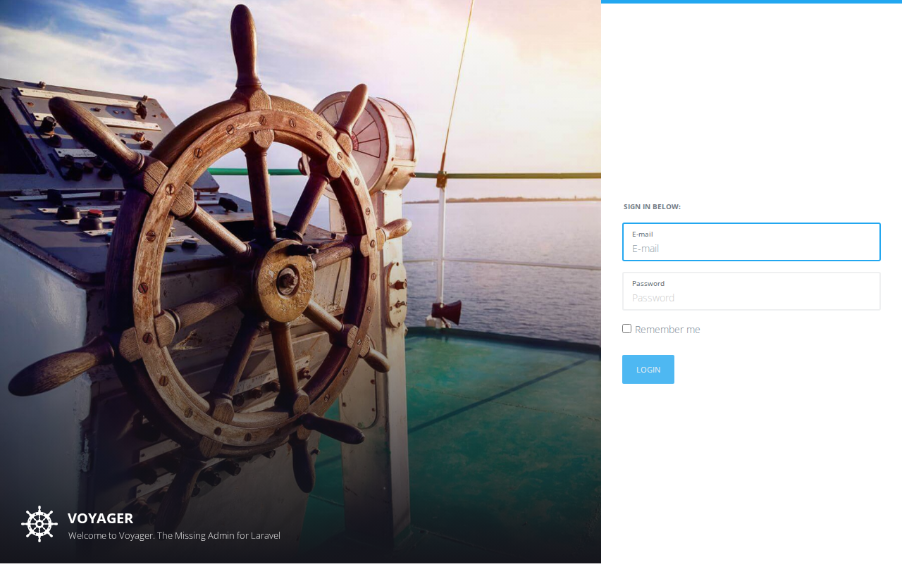

# danialtub

**danialtub** is a robust video-sharing and educational platform ecosystem designed for high performance and modern user experiences. It serves as a comprehensive solution featuring a headless Laravel API for mobile applications, a complete Web UI for students, and an advanced management dashboard for creators and administrators.

<p align="center">
  
</p>

## 🚀 Architecture & Tech Stack

The project follows a modern, clean code architecture to ensure scalability and maintainability.

- **Backend:** [Laravel 8](https://laravel.com/) (Headless API + Blade Views)
- **Database:** SQLite (Local) / MySQL (Production)
- **Admin Panel:** [TCG Voyager](https://voyager-docs.dev/) (Modernized with Tailwind CSS)
- **Frontend CSS:** [Tailwind CSS](https://tailwindcss.com/) with RTL support
- **Typography:** [Vazirmatn](https://github.com/rastikerdar/vazirmatn) Persian font
- **Charts:** [Chart.js](https://www.chartjs.org/) for advanced analytics
- **Authentication:** Laravel Sanctum (Token-based for Android App)

## 🛠️ Setup & Installation Guide

Follow these steps to get the project running locally:

### 1. Clone the repository and install PHP dependencies
```bash
composer install
```

### 2. Install Frontend dependencies and build assets
```bash
npm install
npm run dev
```

### 3. Environment Configuration
Copy the example environment file and generate the application key:
```bash
cp .env.example .env
php artisan key:generate
```
*Note: Ensure `DB_CONNECTION` is set to `sqlite` and `DB_DATABASE` points to your absolute path for the SQLite file.*

### 4. Database Setup & Seeding
Initialize the database, run migrations, and populate with realistic Persian data:
```bash
touch database/database.sqlite
php artisan migrate --force
php artisan db:seed --class=RealisticDataSeeder
```

### 5. Start the Application
```bash
php artisan serve
```

## 📱 Mobile API Documentation (Android)

**CRITICAL:** The API endpoints located in `routes/api.php` are strictly reserved for the **danialtub Android Application**.

- **Internal Refactoring:** The controllers have been refactored and queries optimized for performance, but the JSON response structures remain identical to preserve compatibility.
- **Warning:** Do not modify, rename, or delete existing API keys or response structures, as it will break the mobile application integration.

## 🖼️ Screenshots

### Web Platform Homepage


### Custom Video Player Page


### Admin Panel Dashboard


## 📄 License

The danialtub project is open-sourced software licensed under the [MIT license](https://opensource.org/licenses/MIT).
